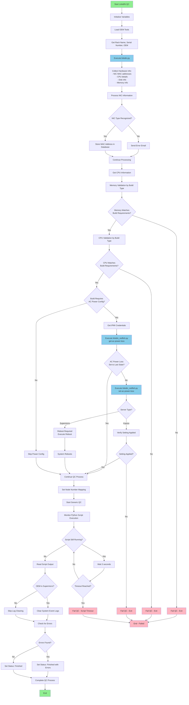

# LinkdIN QC System Flow Diagram

## Build Types Requiring AC Power Configuration
- SMC-ASG-2015S-E1CR24L2-AMD-512G
- SMC-AS-F11145-AMD-256G
- SMC-AS1114CS-AMD-256G
- SMC-AS-2115GT-AMD-1152G
- AVR-AMD-APP-512G

## Key Components

### Python Scripts Called:
1. **linkdin.py** - Always executed for hardware information collection
2. **linkdin_redfish.py** - Conditionally executed for AC power loss configuration

### Validation Types:
- **Memory Validation**: Checks if installed memory matches build specification (64GB to 1152GB)
- **CPU Validation**: Verifies specific CPU models for certain builds
- **NIC Validation**: Captures MAC addresses for recognized network adapters

### Database Updates:
- QC Status (Running/Finished/Failed)
- NIC MAC Addresses
- Node Number Mapping
- BMC IPv6 Configuration

### Error Handling:
- Email notifications for unrecognized hardware
- Timeout protection for long-running scripts
- Comprehensive error logging and status tracking
